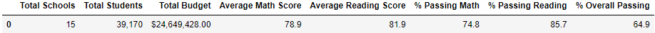
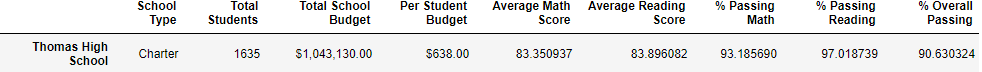
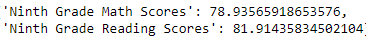

# School District Analysis with Pandas: Replacing and Analyzing Data Using Pandas

## Overview of Project

### Background
Initially, there were two different datasets.  The first dataset was of the schools including: an assigned school identification number from 0 to 14; names of the schools; type of school, either district or charter; size of the school in the number of students; and the budget of the school in terms of US Dollars. The second dataset was of the students including: an assigned student identification number from 0 to 39,169; the names of the students; the gender of the students, which would be either male or female; the grade of the student, which were the high school grades of 9th, 10th, 11th, or 12th grade; the school they attended; their state testing reading scores; and their state testing mathematics scores. The schools that are included in the data set are Bailey High School, Cabrera High School, Figueroa High School, Ford High School, Griffin High School, Hernandez High School, Holden High School, Huang High School, Johnson High School, Pena High School, Rodriguez High School, Shelton High School, Thomas High School, Wilson High School, and Wright High School. The two datasets are then merged into a complete dataset premised on the school's name such that the data elements from the school data set are added to the end of the student dataset if the students had attended that school in a new dataset called “school_data_complete” via a Pandas script.

### Purpose
The purpose of this script as to exclude the whole of the state testing reading and mathematics scores for 9th grade students attending Thomas High School by replacing the grades with NaNs, “denoting “not a number,” while keeping the rest of the data intact. This is given that the school board believes that there may have been some academic dishonesty for these students where the grades had been altered, as allegedly evidenced by the dataset of student grades, however the board is uncertain regarding the extend of the possible alteration. This is to ensure that school board upholds state-testing standards.

## School District Analysis Results

### Analysis Results
The following bulleted list notes the pertinent results for the exclusion of the grades of 9th graders for students attending Thomas High School.

* Above are the printed district analyses prior to and after the exclusion. The first is prior to the exclusion and the second is after. The district summary has undergone the following changes: The assessment of the district overall is done on a count of 38,709 students as opposed to the original total for 39,170 students without the exclusion. The following figures are rounded to the tenth decimal place. Prior to the exclusion, the average mathematics score was 79.0%, the average reading score was 81.9%, the number of students passing the mathematics assessment was 75.0% of the total, the number of students passing the reading assessment was 85.8% of the total, and the number of students passing the state assessments overall was 65.2% of the total. After the exclusion, the average mathematics score was 78.9%, the average reading score was 81.9%, the number of students passing the mathematics assessment was 74.8% of the total, the number of students passing the reading assessment was 85.7% of the total, and the number of students passing the state assessments overall was 64.9% of the total. Thus the difference after the exclusion of the 9th graders from Thomas High School was minor but negative. When rounded to the tenth decimal place, the differences in percentage points are: average mathematics score for (0.1)%, the average reading score for (0.0)%, the number of students passing the mathematics assessment for (0.2)%, the number of students passing the reading assessment for (0.1)%, and the number of students passing the state assessments overall for (0.3)% of the total.

* Above are the printed analyses of Thomas High School prior to and after the exclusion. The first is prior to the exclusion and the second is after. The school summary for Thomas High School has undergone the following changes: the initial calculations prior to the exclusion were based on 1,636 students and while 1,635 students might be still displayed for the exclusions given it is the total number of students, the percentile calculations are based on 10th through 12th graders only which is 1,174 students. The following figures are rounded to the tenth decimal place although the figures above in the image are taken to millionth decimal place. Prior to the exclusion, the average mathematics score was 83.4%, the average reading score was 83.8%, the number of students passing the mathematics assessment was 93.3% of the total, the number of students passing the reading assessment was 97.3% of the total, and the number of students passing the state assessments overall was 90.9% of the total. After the exclusion, the average mathematics score was 83.4%, the average reading score was 83.9%, the number of students passing the mathematics assessment was 93.2% of the total, the number of students passing the reading assessment was 97.0% of the total, and the number of students passing the state assessments overall was 90.6% of the total. Thus the difference after the exclusion of the 9th graders from Thomas High School was minor and generally negative but with one minor positive. When rounded to the tenth decimal place, the differences in percentage points are: average mathematics score for (0.1)%, the average reading score for 0.0%, the number of students passing the mathematics assessment for (0.1)%, the number of students passing the reading assessment for (0.3)%, and the number of students passing the state assessments overall was for (0.3)%.

* Above are the printed analyses of the top five schools overseen by the school board prior to and after the exclusion. The first is prior to the exclusion and the second is after. Excluding the math and reading scores do not Thomas High School's performance relative to the other schools at all. It remains second highest place in passing the state assessments overall.

* Replacement of 9th grade scores for Thomas High School students using the script does the following as well with respect to mathematics and reading scores by grade, scores by school spending, scores by school size, and scores by school type:

    
    
    
    

    * Above are the printed analyses of the mathematics and reading scores by grade and school prior to and after the exclusion. The first is the mathematics scores prior to exclusion, the second is the reading scores prior to exclusion, the third is the mathematics scores after exclusion, and the fourth is the reading scores after exclusion. Mathematics and reading scores by grade are not affected for other students in Thomas High School or for students in any other school.

    
    

    However as noted above the ninth grade averages for the district have changed. First is the ninth grade averages prior to exclusion and the second is ninth grade averages after exclusion. Rounded to the tenth decimal place, the average 9th grade mathematics state examination score for all schools was 78.9% and average 9th grade reading state examination score for all schools was 81.9% prior to the exclusion. After the exclusion, the average 9th grade mathematics state examination score for all schools was 78.7% and average 9th grade reading state examination score for all schools was 81.8% prior to the exclusion. The difference in percentage points are: average mathematics score for (0.2)% and average reading score for (0.1)%.

    
    

    * Above are the printed analyses by spending range prior to and after the exclusion. The first is prior to the exclusion and the second is after. Scores by school spending do not change much. The spending per student at Thomas High School is $638. The respective ranges for spending per student are under $586, $586 to $630, $631 to $645, and $646 to $675. The only range affected is $631 to $645 and the others are not due to the exclusion. Rounded to the tenth decimal place, changes are negative but minor but with the exception of average reading score. The changes in the average mathematics score and percentage points in passing the mathematics state assessment are negligible and round to (0.0)% in percentage points difference. The change in the average reading score is positive but negligible and round to 0.0%. Changes in percentage points in students passing the reading state assessment and passing the state assessments overall both decrease by (0.1)% in percentage points difference of total number of students accounted for. For students passing the reading state assessment, the decline was from 84.4% pre-exclusion to 84.3% post-exclusion. For students passing the state assessments overall, this decline was from 62.9% pre-exclusion to 62.8% post-exclusion.

    
    

    * Above are the printed analyses by ranges of school size prior to and after the exclusion. The first is prior to the exclusion and the second is after. Scores by school size do not change much either. The original number of students at Thomas High School was 1636. After the exclusion, we are including only 10th through 12 graders at Thomas High School for analysis. The ranges for school size are small which is less than 1,000 students, medium which is 1,000 to 1,999 students, and large which is 2,000 to 5,000 students. Rounded to the tenth decimal place, changes for medium sized schools are largely negative but minor with the exception of average reading scores. The scores for small and large schools do not change because Thomas High School is a medium sized school. For medium sized school, changes in average mathematics score, percentage passing the mathematics state assessment, and percentage passing the state assessment overall is negligible and round to (0.0)% in percentage points difference after exclusion. The change in average reading scores was positive but negligible in percentage points difference of 0.0% after exclusion. The change in percentage points of students passing the reading state assessment and passing the state assessment overall was a rounded difference of (0.1)% after exclusion. For students passing the reading assessment this was a change from 96.8% to 96.7% , and, for passing the state assessments overall, both figures round to 90.6% but the difference at the hundredth level round to 0.1% in absolute value.

    
    

    * Above are the printed analyses by ranges of school type prior to and after the exclusion. The first is prior to the exclusion and the second is after. Scores by school type do not change much as well. Thomas High School is a charter school, so district school values do not change. Rounded to the tenth decimal place, changes are generally negative but minor with the exception of average reading score which had a minor improvement. However, when rounded to the tenth decimal place, changes by all five metrics are negligible and round to 0.0% for average reading score or (0.0)% for the rest of the score and passing metrics difference in percentage points. The one positive but negligible increase was average reading score.

## Summary

### Most Notable Outcomes After Exclusion
After the exclusion of the scores of the 9th graders from Thomas High School, the base total number of students that the school board must account for and for Thomas High School has changed given they are no longer considered for the student count. The average scores for mathematics and reading as well as the percentage of students passing the state examinations for both and overall for the district have decreased but at a relatively minor scale between (0.0)% to (0.3)% in percentage points difference when rounded. The same is true for Thomas High School as well with decreases at a relatively minor scale between (0.0)% to (0.3)% in percentage points difference when rounded for most metrics with the exception of average reading scores which increased at a relatively minor scale of 0.0% in percentage points increase when rounded due to the 9th grade students at Thomas High School scoring less than the average of all students at Thomas High School prior to the exclusion. Differences in average scores based on spending per student, school size, and school type was also for the most part negligible. Average scores based on spending per student decreased at a relatively minor scale between (0.0)% to (0.1)% in percentage points difference when rounded for most metrics with the exception on of average reading scores which increased at a relatively minor scale of 0.0% in percentage points increase when rounded. Average scores based on school size decreased at a relatively minor scale between (0.0)% to (0.1)% in percentage points difference when rounded for most metrics with the exception on of average reading scores which increased at a relatively minor scale of 0.0% in percentage points increase when rounded. Finally, Average scores based on school type decreased at a relatively minor scale of (0.0)% in percentage points difference when rounded for most metrics with the exception on of average reading scores which increased at a relatively minor scale of 0.0% in percentage points increase when rounded.
